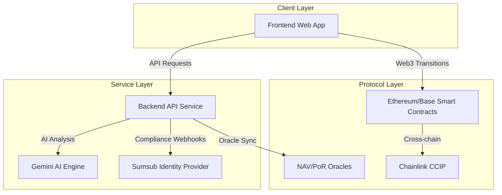

# Aura RWA Platform

Aura is a comprehensive platform for the tokenization, management, and exchange of Real-World Assets (RWA) on the blockchain. By combining institutional-grade smart contracts, AI-driven valuation, and a modern web interface, Aura enables seamless fractional ownership of high-value physical assets.

## Platform Architecture

The Aura platform is organized as a monorepo, separating concerns between the presentation layer, the orchestration layer, and the decentralized protocol layer.



## Repository Structure

### Apps

- **[Frontend](./apps/frontend)**: A React-based single-page application for investors and asset originators.
- **[Backend](./apps/backend)**: An Express.js and Prisma-based orchestration service that coordinates data between the database, AI engine, and blockchain.

### Packages

- **[Contracts](./packages/contracts)**: The core protocol suite, including ERC-3643 compliant tokens, liquidity pools, and oracle coordination logic.

---

## Technical Documentation Map

For detailed technical specifications, architecture diagrams, and operation guides, refer to the specialized documentation within each module:

### Core Architecture
- **[Aura Protocols and Contracts](./packages/contracts/README.md)**: Detailed breakdown of the smart contract interactions and protocol layers.
- **[Backend Orchestration](./apps/backend/README.md)**: Explanation of the service-oriented architecture and blockchain integration.
- **[Frontend Web Application](./apps/frontend/README.md)**: Overview of the React 19 architecture and user flow management.

### Specialized Operation Guides
The [Contracts Documentation](./packages/contracts/README.md) includes specific guides for critical platform operations:
- [Identity and Compliance Management](./packages/contracts/docs/operations/IDENTITY_MANAGEMENT.md)
- [Asset Tokenization Workflow](./packages/contracts/docs/operations/ASSET_TOKENIZATION.md)
- [Marketplace Investment Lifecycle](./packages/contracts/docs/operations/MARKETPLACE_LISTING.md)
- [Oracle Data Synchronization](./packages/contracts/docs/operations/ORACLE_OPERATIONS.md)
- [Cross-Chain Bridge Operations](./packages/contracts/docs/operations/CROSS_CHAIN_TRANSFERS.md)

---

## Tech Stack Overview

### Frontend
- React 19, Vite, Tailwind CSS 4, Framer Motion, Ethers.js v6.

### Backend
- Node.js, Express.js, Prisma ORM, PostgreSQL, Google Gemini Pro.

### Blockchain
- Solidity, Hardhat, OpenZeppelin, Chainlink (Automation, CCIP, CRE).

---

## Getting Started

To install and configure the Aura platform, please follow the comprehensive [Aura Setup Guide](./SETUP.md).

For development, you can start the entire monorepo using:
```bash
pnpm run dev
```
