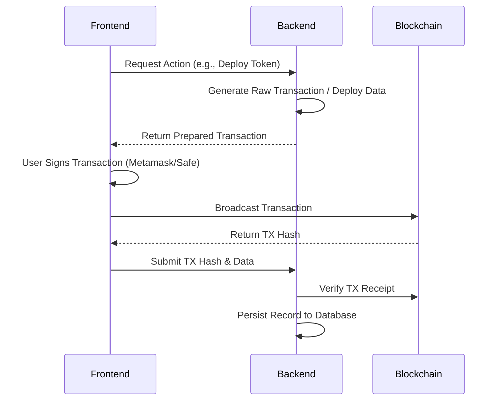
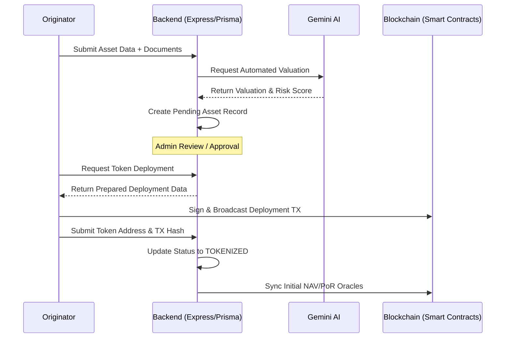
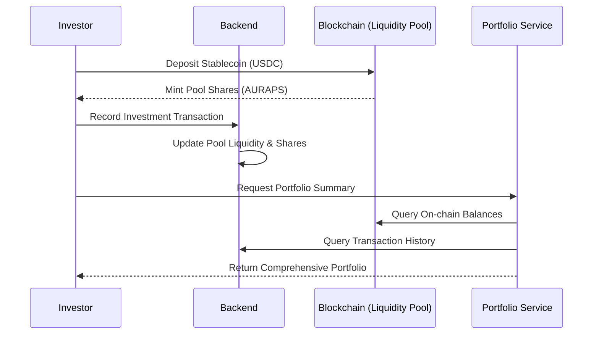

# Aura Backend API

Detailed technical overview of the Aura Real World Asset (RWA) Tokenization Platform backend.

## System Architecture

The Aura backend serves as the orchestration layer between the frontend application, the Ethereum-compatible blockchain (Hardhat/Base/etc.), and external services like Sumsub (KYC) and Google Gemini (AI).

Key responsibilities:
- **Asset Lifecycle Management**: Handling the transition from physical asset data to on-chain tokens.
- **Blockchain Orchestration**: Preparing deployment data and recording on-chain events.
- **Compliance**: Verifying identities and maintaining whitelists.
- **AI Analytics**: Providing automated valuations and risk assessments.
- **Oracle Management**: Syncing real-world valuations to on-chain price feeds.

---

## Blockchain Interaction Layer

The backend interacts with the blockchain through a dedicated `BlockchainService` utilizing `ethers.js v6`. This layer is designed with a non-custodial architecture, ensuring the backend never holds user private keys for sensitive operations like asset transfers or deployments.

### Multi-Contract Integration

The backend coordinates with the following core protocol contracts:

1.  **AuraRwaToken (ERC-3643)**:
    - Prepares deployment bytecode and constructor arguments.
    - Monitors total supply and holders for portfolio aggregation.
    - Triggers decentralized reporting for Net Asset Value (NAV).

2.  **LiquidityPool**:
    - Generates data for pool deployment.
    - Records investor deposits (Invest) and redemptions (Redeem).
    - Checks liquidity and share balance for the Marketplace view.

3.  **IdentityRegistry**:
    - Automatically whitelists verified wallets after successful KYC.
    - Checks verification status before allowing token operations.

4.  **Oracles (NAV and PoR)**:
    - Directly writes valuation data to on-chain oracles through an Admin/Coordinator role.
    - Triggers Chainlink CRE workflows for decentralized data verification.

### Transaction Process Flow

The interaction follows a "Prepare-Sign-Finalize" pattern:

---

## Core Flows

### 1. Asset Tokenization Flow

### 2. Marketplace & Investment Flow

---

## Module Descriptions

### controllers/
The entry point for API requests. Each controller is responsible for parsing inputs, calling the appropriate service, and formatting the HTTP response.
- **asset.controller.js**: Manages the CRUD operations for assets and the multi-step tokenization process.
- **kyc.controller.js**: Handles Sumsub webhook integrations and identity verification status.
- **wallet.controller.js**: Manages user wallet linkings and faucet requests for testnets.

### services/
Contains the core business logic of the application.
- **asset.service.js**: The primary "brain" for asset logic. It coordinates between the database, AI engine, and blockchain service to move assets through their lifecycle.
- **blockchain.service.js**: Low-level wrapper for ethers.js. It handles contract artifact loading, transaction recording, and preparing raw deployment data for non-custodial signing.
- **gemini.service.js**: Generative AI integration that analyzes asset metadata to provide "Fair Value" recommendations and reasoning.
- **portfolio.service.js**: Aggregator service that combines on-chain balance data with off-chain metadata to provide a consolidated user view.
- **sumsub.service.js**: Communicates with the Sumsub API for KYC/KYB processing.

### routes/
Defines the RESTful API surface area.
- **/assets**: Onboarding, tokenization, and listing endpoints.
- **/marketplace**: Browsing active liquidity pools.
- **/portfolio**: User balance and performance summaries.
- **/kyc**: Identity verification workflows.

---

## Technical Stack

- **Runtime**: Node.js (Express.js)
- **Database**: PostgreSQL with [Prisma ORM](https://www.prisma.io/)
- **Blockchain Interface**: [Ethers.js v6](https://docs.ethers.org/v6/)
- **AI**: [Google Gemini Pro / Flash](https://ai.google.dev/)
- **Compliance**: [Sumsub API](https://sumsub.com/)

---

## Security & Compliance

- **Authentication**: JWT-based via Auth0.
- **Identity Registry**: Only verified identities (sumbmitted via Sumsub) can interact with RWA tokens on-chain.
- **Non-Custodial**: The backend prepares transactions (deployments, mints), but never holds user private keys. Users sign and broadcast transactions directly from the frontend.
- **Rate Limiting**: Implemented on sensitive endpoints (faucet, onboarding).
- **Artifact Verification**: Contract ABIs and bytecodes are loaded from a shared `packages/contracts` repository to ensure environment consistency.
