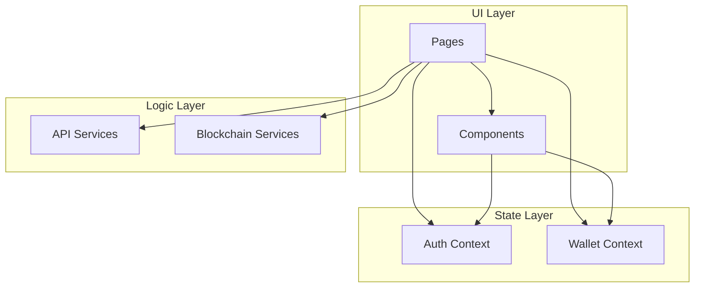
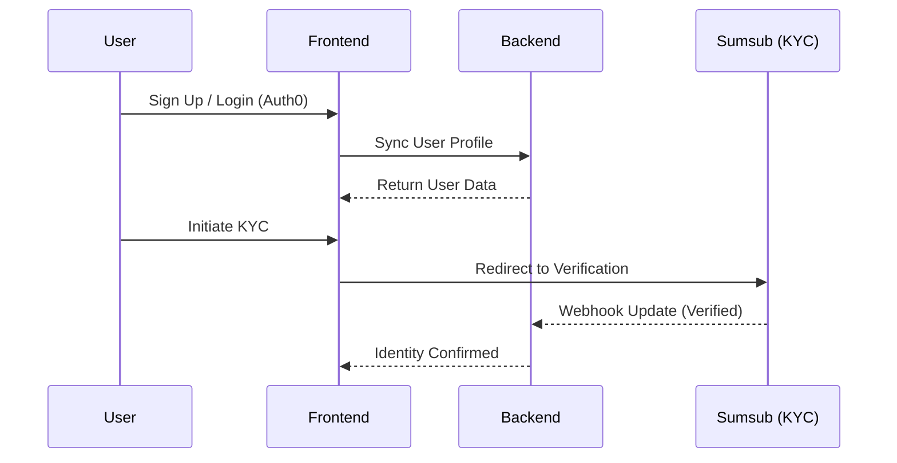
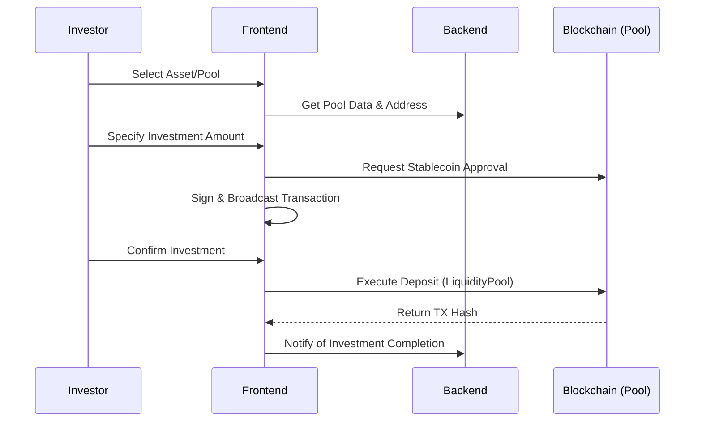

# Aura Frontend

The primary web interface for the Aura Real World Asset (RWA) Tokenization Platform. This application provides a high-fidelity experience for users to interact with tokenized real-world assets on the blockchain.

## Application Architecture

The frontend is a modern single-page application (SPA) built with React 19 and Vite. It utilizes a layered architecture to separate UI components, business logic, and blockchain interactions.

### Component Hierarchy and State

The application uses the React Context API for global state management, specifically for authentication and wallet connectivity. Page-level components are located in the `pages/` directory, while reusable UI elements are organized within `components/`.



## Core Modules

### Investor Dashboard
The dashboard provides a consolidated view of a user's portfolio. It aggregates data from the backend API and directly from the blockchain to show real-time valuations, performance metrics, and transaction history.

### Asset Marketplace
The marketplace allows users to browse listed assets, filter by category (Real Estate, Art, Carbon, etc.), and view detailed performance data. It interfaces with the `LiquidityPool` contracts to facilitate investments and redemptions.

### Asset Onboarding
A specialized workflow for asset originators to submit asset details, legal documents, and images. This module integrates with the backend's AI engine to provide immediate valuation feedback.

---

## User Flows

### Authentication and Onboarding
The application follows a secure onboarding flow, integrating identity verification as a prerequisite for blockchain interactions.



### Investment Lifecycle
Investors interact with smart contracts through the frontend using a non-custodial pattern.



---

## Technical Stack

- **Core**: React 19, Vite, React Router 7
- **Styling**: Tailwind CSS 4, Framer Motion (animations), Lenis (smooth scrolling)
- **Web3 Interface**: Ethers.js v6
- **Identity**: Sumsub Web SDK integration
- **Icons**: Lucide React
- **API Client**: Axios

## Project Structure

```text
src/
├── assets/          # Static assets (images, fonts, etc.)
├── components/      # Reusable UI components
│   ├── shared/      # Common components like Button, Input, Navbar
│   ├── marketplace/ # Marketplace-specific components (AssetCard, filters)
│   └── dashboard/   # Dashboard widgets and layouts
├── context/         # React Context providers (Auth, Wallet, Theme)
├── contracts/       # Smart contract ABIs and addresses
├── pages/           # Page-level components (Home, Marketplace, Dashboard)
├── services/        # API and Blockchain interaction logic (ethers.js wrappers)
└── utils/           # Helper functions and constants
```


