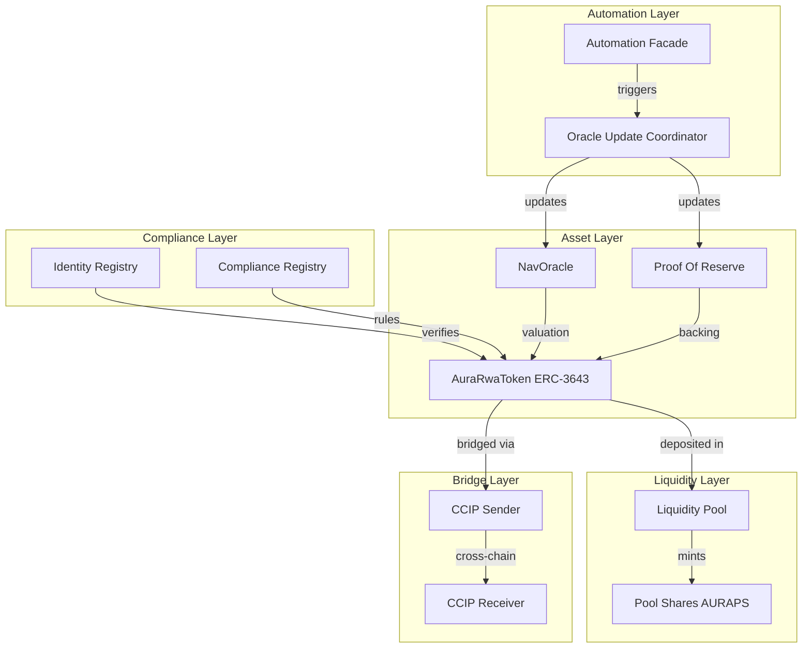

# Aura Smart Contracts

Detailed technical documentation for the Aura Real World Asset (RWA) Tokenization Protocol.

## Architecture Overview

The Aura protocol is built on a modular architecture that separates asset representation, compliance, valuation, and liquidity.

## Contract Directory

### Core Protocol

| Contract | Description |
|---|---|
| AuraRwaToken | ERC-3643 compliant token representing the fractionalized real-world asset. |
| IdentityRegistry | Stores and manages KYC/AML verification status for user wallets. |
| ERC3643ComplianceRegistry | Manages the ruleset for compliant transfers. |
| LiquidityPool | Handles token deposits, share issuance, and redemptions. |

### Data and Oracles

| Contract | Description |
|---|---|
| NavOracle | On-chain store for Net Asset Value (NAV) data per pool. |
| ProofOfReserve | On-chain store for Proof of Reserve (PoR) data per asset. |
| OracleUpdateCoordinator | Orchestrates synchronized updates to NAV and PoR oracles. |
| OracleConsumer | Receives data reports from decentralized oracle networks (DONs). |

### Infrastructure

| Contract | Description |
|---|---|
| AuraCcipSender | Initiates cross-chain transfers using Chainlink CCIP. |
| AuraCcipReceiver | Handles incoming cross-chain messages and tokens. |
| AutomationFacade | Provides a standardized interface for Chainlink Automation upkeep. |

---

## Detailed Operation Guides

The protocol operations are divided into specific workflows. Refer to the individual guides for detailed technical instructions and flowcharts:

1. [Identity Management](./docs/operations/IDENTITY_MANAGEMENT.md)
   Managing wallet verifications and compliance settings.

2. [Asset Tokenization](./docs/operations/ASSET_TOKENIZATION.md)
   Deploying new RWA tokens and managing supply.

3. [Marketplace & Liquidity Pools](./docs/operations/MARKETPLACE_LISTING.md)
   Setting up investment pools and share structures.

4. [Oracle & Data Synchronization](./docs/operations/ORACLE_OPERATIONS.md)
   Syncing real-world valuations to the blockchain.

5. [Cross-Chain Operations](./docs/operations/CROSS_CHAIN_TRANSFERS.md)
   Moving assets and data across supported networks.

---

## Security and Compliance

The protocol adheres to the ERC-3643 standard, ensuring that every transfer is validated against an identity registry. This ensures that assets are only held by verified participants, meeting regulatory requirements for institutional-grade RWAs.
