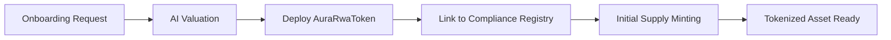

# Asset Tokenization Operation

This guide describes the workflow for deploying and managing Real World Asset (RWA) tokens.

## Process Overview

Asset tokenization involves deploying an ERC-3643 compliant contract and configuring its metadata and minting controls.

## Workflow Steps

### 1. Token Deployment
A new instance of the AuraRwaToken is deployed for each unique physical asset or asset class.

### 2. Metadata Configuration
Symbol, name, and decimals are fixed at deployment, while the NAV Oracle link can be updated by the owner.

### 3. Supply Management
Authorized issuers can mint tokens to specific verified wallets based on physical backing evidence.

## Technical Reference

Relevant contracts:
- AuraRwaToken.sol

Relevant scripts:
- scripts/interactions/deploy-token.ts
- scripts/interactions/03-mint-tokens.ts
