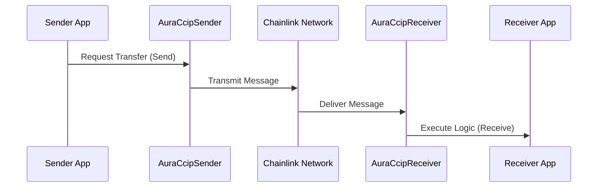

# Cross-Chain Operations Guide

This guide describes how the Aura protocol moves assets and data across different blockchain networks using Chainlink CCIP.

## Process Overview

Cross-chain interaction enables liquidity and data availability on multiple networks (e.g., Sepolia to Fuji).

## Bridge Mechanism

### 1. Token Bridging
Tokens can be transferred between chains by locking them on the source chain and minting/unlocking on the destination chain.

### 2. Data Bridging
Oracle reports or governance instructions can be transmitted to ensure consistency across all deployed networks.

## Technical Reference

Relevant contracts:
- AuraCcipSender.sol
- AuraCcipReceiver.sol
- CcipConsumer.sol

Relevant scripts:
- scripts/interactions/07-deploy-bridgeable-pool-and-setup-ccip.ts
- scripts/interactions/08-verify-ccip-flow-config.ts
