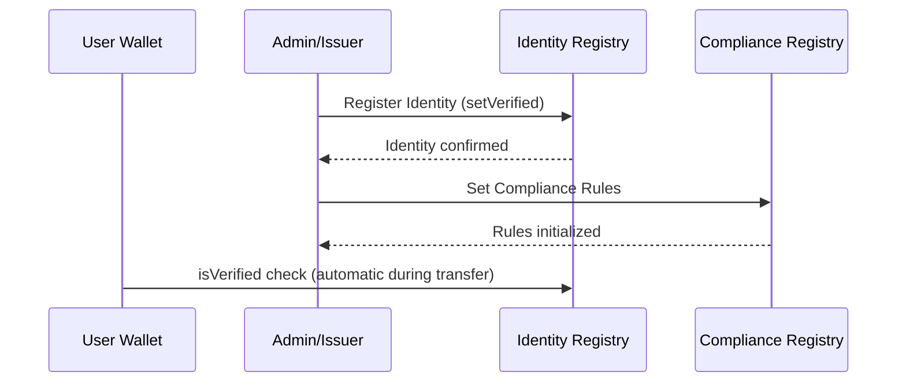

# Identity Management Operation

This guide details the processes for managing wallet identities and compliance registries within the Aura protocol.

## Process Overview

Before a user can hold or transfer Aura RWA tokens, their wallet address must be registered in the Identity Registry.

## Key Actions

### 1. Wallet Verification
Wallets are verified by an authorized identity provider or platform admin. This is a prerequisite for any asset interaction.

### 2. Compliance Configuration
The Compliance Registry defines the specific rules for each asset class (e.g., maximum holders, geographic restrictions).

## Technical Reference

Relevant contracts:
- IdentityRegistry.sol
- ERC3643ComplianceRegistry.sol

Relevant scripts:
- scripts/interactions/01-setup-identity.ts
- scripts/interactions/register-all-env-addresses-identity.ts
