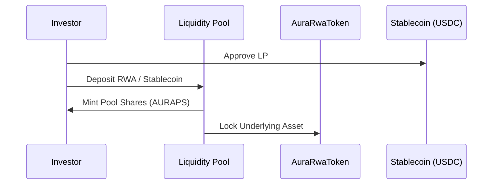

# Marketplace and Liquidity Pools Operation

This guide explains how to set up and manage investment pools for tokenized assets.

## Process Overview

Liquidity pools allow investors to deposit stablecoins in exchange for pool shares (AURAPS), providing liquidity for the underlying RWA.

## Key Components

### 1. Share Mechanism
Pool shares are minted using a 1:1 or NAV-adjusted ratio, depending on the pool configuration.

### 2. Investment and Redemption
Investors can enter or exit the pool based on the current Net Asset Value reported by the oracles.

## Technical Reference

Relevant contracts:
- LiquidityPool.sol

Relevant scripts:
- scripts/interactions/04-invest-pool.ts
- scripts/interactions/07-deploy-bridgeable-pool-and-setup-ccip.ts
