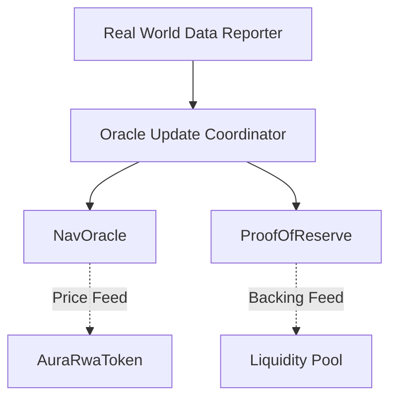

# Oracle and Data Synchronization Operation

This guide details the mechanism for keeping on-chain asset valuations synchronized with real-world data.

## Process Overview

The protocol uses a coordinated system to update Net Asset Value (NAV) and Proof of Reserve (PoR) data.

## Sync Workflow

### 1. Data Aggregation
The Oracle Update Coordinator receives data from authorized sources (or Chainlink DONs via OracleConsumer).

### 2. Batch Updates
To ensure atomicity, NAV and PoR data are updated in a single transaction sequence when possible.

### 3. Verification
Consumers (like the Liquidity Pool) check the timestamp of the last oracle update to ensure data freshness.

## Technical Reference

Relevant contracts:
- NavOracle.sol
- ProofOfReserve.sol
- OracleUpdateCoordinator.sol

Relevant scripts:
- scripts/interactions/02-update-oracles.ts
- scripts/interactions/05-link-nav-oracle.ts
